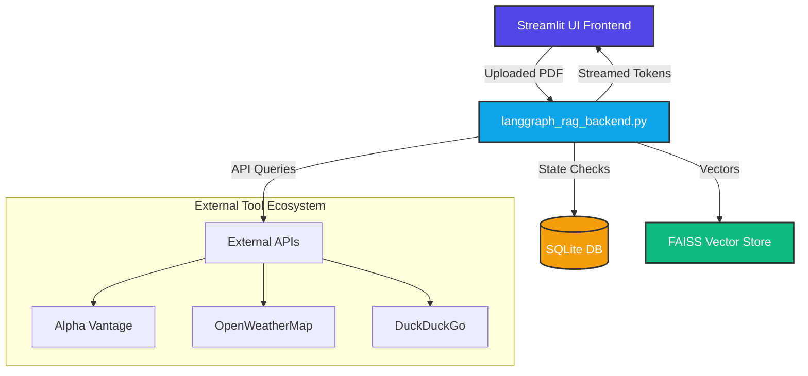
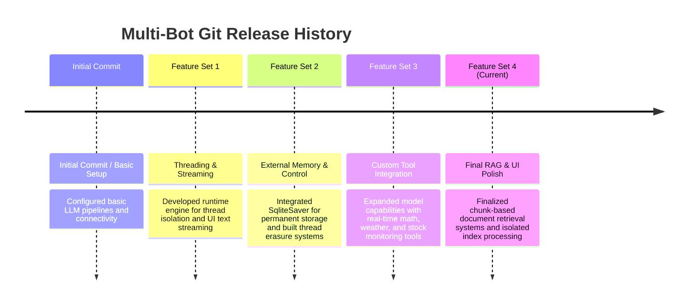

# 🤖 MULTI-BOT: Multi-Tool RAG Chatbot

An advanced, stateful Conversational AI application that implements a Multi-Tool Retrieval-Augmented Generation (RAG) agent. The system features long-term chat persistence, asynchronous document processing, real-time tool execution notifications, and live response streaming.

---

## 🚀 Key Features

* **Stateful Multimodal RAG Engine:** Dynamically indexes uploaded PDF files into a localized `FAISS` vector space mapped to distinct browser sessions (`thread_id`).
* **Live Stream Tokenizer:** Implements token-by-token text generation rendering directly inside the web UI.
* **Dynamic Tool Node Integration:** Seamlessly switches context between internal document search and external web services.
* **Persistent SQLite Checkpointing:** Retains complete chronological conversation graphs across server restarts.
* **Granular Thread Operations:** Includes fully managed session states with features to create, reload, isolate, or permanently delete individual conversational database threads.

---

## 🛠️ System Architecture & Tech Stack



### Backend Architecture
* **Orchestrator:** `LangGraph` StateGraph engine managing condition-driven routing loops between models and tools.
* **Core Language Model:** `MiniMaxAI/MiniMax-M2.7` deployed via Hugging Face Endpoints.
* **Embeddings Pipeline:** `sentence-transformers/all-mpnet-base-v2` managing vector space translations.
* **Vector Engine:** In-memory `FAISS` storage handling dynamic segment matching per `thread_id`.
* **Database Checkpointer:** Native `SqliteSaver` handling local transactional rollback structures inside `chatbot.db`.

### Built-in Tool Ecosystem
* `rag_tool`: Context-aware information locator targeting localized document chunks.
* `get_stock_price`: Live financial market tracking powered by Alpha Vantage.
* `get_weather_data`: Atmospheric metrics pulled directly from OpenWeatherMap.
* `calculator`: Isolated numerical processing node preventing mathematical hallucinations.
* `search_tool`: Web fallback layer using DuckDuckGo Search API.

---
## ⚙️ How It Works (Execution Pipeline)

* **Input:** User uploads a target document via the Streamlit frontend or inputs text inside the runtime console.
* **Indexing:** The pipeline extracts textual strings using `PyPDFLoader`, splits the document using `RecursiveCharacterTextSplitter`, and creates embeddings.
* **Storage:** Extracted document embeddings are dynamically cached inside an isolated in-memory `FAISS` structure mapped to a unique `thread_id`.
* **Retrieval:** If document queries match, a similarity search retrieves the 4 most relevant text segments from the active vector graph.
* **Prompt Creation:** LangGraph injects the structural system instructions alongside retrieved information and active thread histories into a unified payload block.
* **Generation:** The Hugging Face LLM endpoint uses the bound context block to construct accurate, factually grounded answers.
* **Frontend:** Streamlit evaluates the return messages, parses runtime statuses to showcase intermediate tool selections, and streams the finished content to the interface.

---

## 📋 Prerequisites & Local Setup

### 1. Repository Setup
```bash
git clone <your-repository-url>
cd <repository-directory>
```

### 2. Environment Configuration
Create a `.env` file in your root workspace folder and populate your API credentials:
```env
HUGGINGFACEHUB_API_TOKEN=your_huggingface_token_here
ALPHA_VANTAGE_API_KEY=your_alpha_vantage_key_here
OPENWEATHERMAP_API_KEY=your_openweathermap_key_here
```

### 3. Installation
Install the necessary system and pipeline dependencies:
```bash
pip install streamlit langgraph langchain langchain-community langchain-huggingface faiss-cpu pypdf sqlite3 python-dotenv requests
```

---

## 🏃 Execution

Start the full stack application through the Streamlit interface:
```bash
streamlit run streamlit_rag_frontend.py
```

---

## 📈 Development Roadmap & Git History


* **Initial Commit / Basic:** Configured basic LLM pipelines and connectivity.
* **Feature Set 1:** Developed the runtime engine for thread isolation and UI text streaming.
* **Feature Set 2:** Integrated `SqliteSaver` for permanent data storage and built thread erasure systems.
* **Feature Set 3:** Expanded the model's capabilities by adding real-time math, weather, and stock monitoring tools.
* **Feature Set 4:** Finalized chunk-based document retrieval systems, isolated file index processing, and updated interface stability.

## 🤝 Contributing
Pull requests are welcome! For major changes, please open an issue first to discuss what you’d like to change.

🔗 Repositor
https://github.com/Vedantjaiswal4352/CHATBOT
